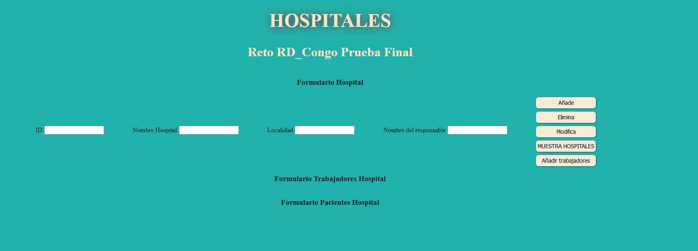
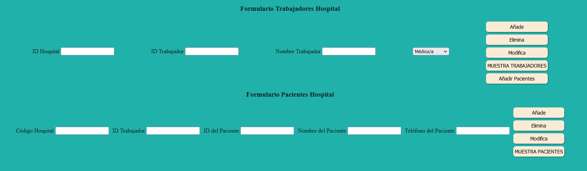

# ap_a_Prog_Carmen_SanDiego
## Carmen Ortiz

Reto Misión 2: RD Congo de [Aprende a Programar](https://aprendeaprogramar.org/moodle/)

La misión consiste en crear diferentes clases:
* Clase Hospital
* Clase Personal
* Clase Paciente

Un hospital tiene muchos trabajadores, y un trabajador tiene muchos pacientes.

### Mi solución
Primero he creado la clase Paciente que tiene nombre, teléfono y dni para poder indentificarlo.
Segundo he creado la clase Personal que tiene nombre, especialidad y un id para identificarlo, y además un "set" de pacientes.
Tercero he creado la clase Hospital que tiene nombre, localidad, director  y código para identificarlo, también tiene un "set" de personal, ya que
un hospital tiene muchos trabajadores y estos a su vez, cada uno de ellos un "set" de pacientes.
Por último, he creado una clase Hospitales que contiene un set de hospitales, desde la cual trato diferentes hospitales, que
a su vez tienen lo anterior descrito.
Respecto al diseño, he creado un html con diferentes formularios para tratar los datos.

En primer lugar aparece "FORMULARIO HOSPITAL" donde se puede añadir, eliminar, modificar y mostrar los diferentes hospitales.
Una vez añadidos, cliclamos mostrar y clicamos en "AÑADIR TRABAJADORES", entonces se despliega el "FORMULARIO DE TRABAJDORES HOSPITAL", con las
mismas funcionalidaes que el anterior formulario. Y de igual manera el "FORMULARIO PACIENTES HOSPITAL".

### Creación de Test con Jest
(Recomendado tener instalado JEST)
Aunque es recomendable realizar test antes de implementar todas las funcionalidades de la web, por último he realizado un test con Jest para
comprobar que las funciones escritas en mis clases funcionan.
Si deseas comprobar:
* Tener instalado jest
* Poner el comando "npm run test"
